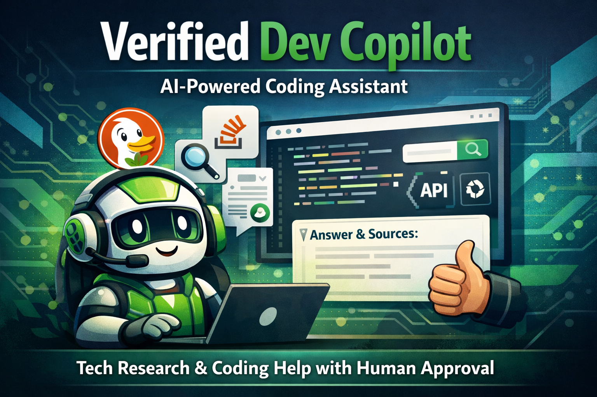
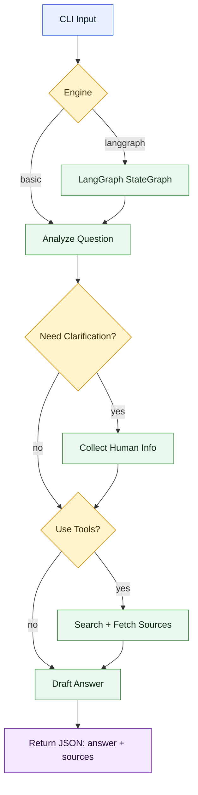

# Verified Dev Copilot (LangChain + optional LangGraph)



## Overview
A developer-focused chatbot agent that answers technical questions using:
- DuckDuckGo web search
- StackOverflow search (StackExchange API)
- Official documentation discovery (site-biased search)
- Page fetching for grounded excerpts
- Human approval loop before finalizing

Designed as a portfolio-ready “agentic research” demo for Upwork profiles.

## Flow Diagram


## What it Returns
JSON with:
- `answer`: final response (includes a `Sources:` section)
- `sources`: URLs found in the answer (filtered to fetched URLs)

## Demo
```bash
python app/agent.py --question "Why does pip say SSL: CERTIFICATE_VERIFY_FAILED on macOS?"
```

Example output:
```json
{
  "answer": "Try these steps on macOS:\n1. Install/refresh certs ...\n2. Upgrade pip and certifi ...\n3. Check corporate proxy or custom CA ...\n\nSources:\n- https://pip.pypa.io/en/stable/user_guide/#ssl\n- https://docs.python.org/3/library/ssl.html",
  "sources": [
    "https://pip.pypa.io/en/stable/user_guide/#ssl",
    "https://docs.python.org/3/library/ssl.html"
  ]
}
```

## Reliability & Guardrails
- Human approval gate before any web/tools research (unless `--no-approval` is set).
- Citations must come from fetched URLs; sources list is filtered to those URLs.
- Clarifying questions are asked only when needed to avoid wrong advice.

## Configuration
| Variable | Default | Purpose |
| --- | --- | --- |
| `LM_STUDIO_BASE_URL` | `http://localhost:1234/v1` | Local OpenAI-compatible endpoint |
| `LM_STUDIO_API_KEY` | `lm-studio` | API key for the local endpoint |
| `LM_STUDIO_MODEL` | `qwen/qwen-3-1.7b` | Model name for the local endpoint |

CLI flags:
- `--engine langgraph|basic`
- `--max-sources`, `--max-page-chars`, `--max-context-chars`
- `--no-approval`

## Project Layout
- `app/agent.py`: CLI entrypoint (basic engine + optional LangGraph engine).
- `app/tools.py`: Search + fetch tools (DuckDuckGo, StackOverflow, docs search).

## Run
```bash
python app/agent.py --question "How do I fix pip SSL errors on macOS?"
```

Optional:
```bash
python app/agent.py --engine basic --question "How do I fix pip SSL errors on macOS?"
```

## Interactive CLI
```bash
python app/agent.py --interactive
```

## Notes
- DuckDuckGo + StackOverflow require outbound network access.
- The default LLM config targets a local OpenAI-compatible endpoint:
  `LM_STUDIO_BASE_URL="http://localhost:1234/v1"` (e.g., LM Studio).
- Set `LM_STUDIO_API_KEY` if your local endpoint requires a key (default: `lm-studio`).
- Override the model with `LM_STUDIO_MODEL` (default: `qwen/qwen-3-1.7b`).
- `.env` is supported if you install `python-dotenv`.
- The agent asks for human input when it needs missing details (OS, versions, errors).
- The agent asks for approval only when it wants to use web/tools for research.
- Install `questionary` for nicer interactive prompts (arrow-key selection + input highlight).
- Install `rich` for panelled markdown output in interactive mode.

## Limitations
- Web search and StackOverflow APIs depend on external network access.
- HTML parsing can be brittle if providers change their markup.
- Output quality depends on the local model and prompt adherence.
